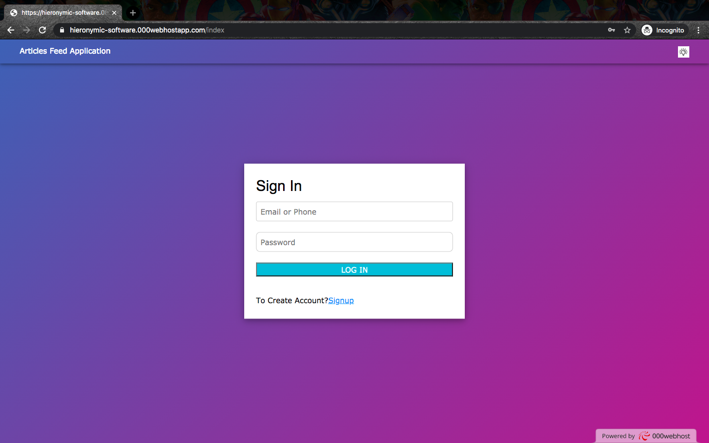

# articles-feed
I created articles-feed web application using Laravel-PHP-framework with mvc pattern. 
In this application user need to register for login to article dashboard. 
After successfull login user can see the articles-feed of all users,He can like, dislike, block the articles. He can create and edit the articles also he can edit his/her profile informations.
so this web application is used for know about the technologies and general knowledge and education purposes.

Tools and Technologies Used: Laravel-php-framework,html,css,w3.css,javascript.

I Hosted my project in OOOwebhost.com 

HostLink: https://articlesfeed.000webhostapp.com/

Here is the Steps I follow to deploy my project

step1: create an account in OOOwebhost.com(free).

step2: After creating I need to create a subdomain(take sometime to create).

step3: After successfull domain creation I loged in to cpanel then I uploaded my project file(I recommend you to upload the files in .zip format because some files may be missing while uploading as folder).

step4: After extracting my zip file,I moved the public folder to (public_html) folder.

step5: I need to add the path in "public_html/publi/index.php" from require DIR.'../../vendor.autoload.php'; to require DIR.'../../article/vendor.autoload.php'; and add this $app->bind('path.public', function() { return DIR; }); //for changing the public path.

step6: After that, I need to create database for my project,I Import my stored sql(sample.sql) file to phpmyadmin.

step7: After that I need to change db_name,db_username,db_password,db_host in .env file in article/.env and copy the app_key="base64:qwsfewfcddvrgvd..." for encode decode purpose.

step8: I paste the key into Article/config/app.php Encryption Key like 'key' => env('APP_KEY', base64_decode('pastedkey')).
Also change the Application debug mode to true ('debug' => env('APP_DEBUG', false) to 'debug' => env('APP_DEBUG', true)).

step9: After that I also need to change db_name,db_username,db_password,db_host in "Article/config.database.php"and add 'options' => [PDO::ATTR_EMULATE_PREPARES => true] in 'mysql'.

step10:Finally I refreshed my created hosting website (https://hieronymic-software.000webhostapp.com). project runned sucessfully.

sample output:

